# Sentinel — pipeline em swimlanes, com custo real medido

Todo número anotado nas setas abaixo é medido nesta sessão (run real de
31min, `obs-medicao-2026-08-27`; ou runs de vazão de CT ao vivo contra
Argon2026h2) — quando não foi possível medir, a seta diz explicitamente
**NÃO VERIFICADO**, nunca um valor inventado.

```mermaid
flowchart LR
    subgraph L1["① Ingestão"]
        direction TB
        CT["Log CT<br/>Argon2026h2<br/>(RFC 6962, polling paralelo)"]
        PF["Prefiltro<br/>determinístico<br/>(Levenshtein, zero LLM)"]
        GT["Gemma 3 270M<br/>triagem em lote"]
    end

    subgraph L2["② Governança"]
        direction TB
        REG["Agent Registry<br/>(descoberta de contrato)"]
        GW["Agent Gateway<br/>(auth + schema + rate limit)"]
    end

    subgraph L3["③ Execução"]
        direction TB
        ORCH["Orchestrator<br/>(cache-first)"]
        BM["Brand Memory<br/>(few-shot adaptativo)"]
        GEM["Gemini<br/>classificação"]
        EVID["Evidence Agent<br/>(scraping/RDAP/screenshot)"]
    end

    subgraph L4["④ Human-in-the-loop"]
        direction TB
        DASH["Dashboard<br/>revisão"]
        APPROVE{"Aprovação<br/>humana"}
    end

    subgraph L5["⑤ Ação"]
        direction TB
        TD["Takedown Agent<br/>(seleção de canal, enum fechado)"]
        NOTIFY["Notificação<br/>(RDAP resolve destino)"]
    end

    CT -->|"450.247 domínios avaliados<br/>0 tokens — matemática pura"| PF
    PF -->|"ANTES do fix: 28.512 enfileirados (6,33% escape)<br/>DEPOIS: ~2.270 projetado (0,50%)<br/>medido, não estimado"| GT
    GT -->|"Ollama indisponível na medição de 31min:<br/>100% fail-open (28.509/28.509) → tudo segue<br/>Gemma real (amostra n=3): 100% DISCARD,<br/>AMOSTRA PEQUENA DEMAIS PARA NÚMERO"| ORCH

    REG -.->|"resolve versão/contrato ativo<br/>(0 tokens, leitura Firestore)"| ORCH
    GW -.->|"schema + rate limit (30/min)<br/>0 tokens — validação de payload"| ORCH
    GW -.->|"takedown-agent NUNCA roteável<br/>via gateway (decisão Sprint 8)"| TD

    BM -.->|"few-shot: +234 tokens,<br/>+US$0,0001755/chamada<br/>(medido, Etapa C)"| GEM
    ORCH -->|"cache-first (Firestore): 943 cache hits<br/>(0 tokens) de 3.039 processados;<br/>cache miss segue abaixo"| GEM
    GEM -->|"2.096 chamadas reais ao Gemini<br/>876 tokens/chamada (média)<br/>US$0,000885/chamada<br/>479 MALICIOUS confirmados"| ORCH
    ORCH -.->|"dossiê incompleto → coleta<br/>de evidência (NÃO VERIFICADO<br/>volume real nesta sessão)"| EVID

    ORCH -->|"requires_human_review = injeção+SAFE<br/>OU brand.should_escalate<br/>OU cost-guard-blocked"| DASH
    DASH --> APPROVE
    APPROVE -->|"approved_by + approved_at +<br/>decision_rationale gravados"| TD
    APPROVE -.->|"rejeitado → vira exemplo<br/>REJECTED_FALSE_POSITIVE<br/>no Brand Memory"| BM

    TD -->|"seleção de canal (LLM, enum fechado)<br/>custo NÃO VERIFICADO hoje —<br/>só mock em teste, sem run real"| NOTIFY
    NOTIFY -->|"DRY_RUN=true — nenhum envio<br/>real disparado nesta sessão"| DASH
```

## Leitura das setas — o que cada uma prova

- **CT → Prefiltro**: 450.247 é o denominador real da medição de custo
  desta sprint (`obs-medicao-2026-08-27`), não uma projeção.
- **Prefiltro → Gemma**: os dois números (antes/depois do bug + ajuste de
  threshold) vêm da mesma amostra de 450.247 domínios, reavaliada duas
  vezes — `FINDINGS.md` SS10.
- **Gemma → Orchestrator**: a medição de custo rodou com Gemma
  indisponível (Ollama fora do ar) — **100% fail-open é o número real
  medido em escala**, não hipotético. O "100% DISCARD" com Gemma real é
  de uma amostra de 3 triagens (n=3) rodada à parte, nesta mesma sessão,
  contra Ollama local de verdade — direcionalmente animador, mas 3
  amostras não sustentam uma taxa.
- **Brand Memory → Gemini**: número da Etapa C (sprint anterior),
  reaproveitado aqui porque é o único custo de few-shot medido contra o
  Gemini real que existe no projeto.
- **Orchestrator → Gemini**: os únicos dois números de custo por chamada
  realmente medidos contra Vertex AI nesta sessão (2.096 chamadas, run de
  31min). O teto de gasto do GCP (`Spend cap breached`, ver `README.md`)
  impediu uma segunda medição com o prefiltro já corrigido — por isso este
  número ainda reflete o cenário de fail-open (pior caso), não produção
  plena.
- **Orchestrator → Evidence Agent** e **Takedown → Notificação**: sem
  medição real nesta sessão — marcados explicitamente como NÃO VERIFICADO
  em vez de omitidos ou estimados.
